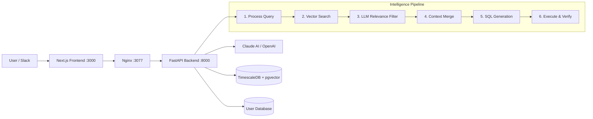

# Analyst Zero

**AI analysts that understand your business, not just your schema.**

Analyst Zero replaces the need for a dedicated data analyst by deploying **Domain Agents** — AI analysts scoped to specific business domains like Sales, Marketing, or Operations. Each agent builds a semantic knowledge graph of your database through embeddings, business metrics, and curated examples, then answers natural-language questions via a 6-stage intelligence pipeline that goes far beyond simple text-to-SQL.

---

## Key Features

- **Domain Agents (Charters)** — Scope AI analysts to specific business domains with custom metrics, examples, and data entities
- **Semantic Vector Search** — pgvector-powered cosine similarity retrieval across tables, metrics, and query examples
- **LLM Relevance Filtering** — An AI judgment layer that scores and filters retrieved context before SQL generation
- **Multi-Database Support** — Connect to PostgreSQL, MySQL, Snowflake, and SQLite with dialect-aware query generation
- **Slack Integration** — Ask questions and get answers directly in Slack via bot integration
- **Error Recovery** — Automatic SQL correction with up to 3 retry attempts on query failure
- **SQL Playground** — Interactive query editor for exploring and refining generated queries
- **Dashboards** — Pin and organize queries into reusable dashboard views

---

## Architecture



---

## Intelligence Pipeline

| Stage | What it does |
|-------|-------------|
| **1. Process Query** | Expands the user's question with conversation history and resolves business metric definitions |
| **2. Vector Search** | Retrieves the most relevant tables, metrics, and examples via pgvector cosine similarity |
| **3. LLM Relevance Filter** | Each candidate is independently scored by an LLM — only items with relevance score >= 2 pass through |
| **4. Context Merge** | Merges user-pinned context (selected tables/metrics) with AI-retrieved metadata |
| **5. SQL Generation** | LLM generates a dialect-aware SQL query from the filtered context and user question |
| **6. Execute & Verify** | Runs the query on the user's database; on failure, auto-corrects and retries (up to 3 attempts) |

---

## Tech Stack

| Layer | Technology |
|-------|-----------|
| **Frontend** | Next.js 14.2, React 18, TypeScript 5, Tailwind CSS 3.4 |
| **Backend** | Python, FastAPI 0.115, SQLAlchemy 2.0, Pydantic 2.9, Uvicorn |
| **AI / LLM** | Anthropic Claude (anthropic 0.39), OpenAI (openai 1.51), Groq |
| **Database** | TimescaleDB (PostgreSQL 17), pgvector 0.3 |
| **Integrations** | Slack SDK 3.33, SendGrid, NextAuth |
| **Infrastructure** | Docker, Nginx, Alembic (migrations) |

---

## Quick Start

### Prerequisites

- Docker & Docker Compose
- Node.js 18+
- Python 3.11+

### Setup

```bash
# Clone the repository
git clone https://github.com/Sentient-Zero-Labs/analyst0-mvp.git
cd analyst0-mvp

# Copy environment files
cp ai-backend/.env.example ai-backend/.env
cp analyst-ui/.env.example analyst-ui/.env

# Fill in your API keys and database credentials in both .env files

# Start all services
docker-compose up --build
```

Access the app at **http://localhost:3000** (or via Nginx at **http://localhost:3077**).

---

## Environment Variables

### Backend (`ai-backend/.env`)

| Variable | Description |
|----------|-------------|
| `ENV` | Environment: `local`, `dev`, or `prod` |
| `CLAUDE_API_KEY` | Anthropic Claude API key |
| `OPENAI_API_KEY` | OpenAI API key |
| `GROQ_API_KEY` | Groq API key |
| `POSTGRES_SERVER` | TimescaleDB host |
| `POSTGRES_USER` | Database user |
| `POSTGRES_PASSWORD` | Database password |
| `POSTGRES_DB` | Database name |
| `SECRET_KEY` | JWT signing secret |
| `FRONTEND_URL` | Frontend URL for CORS |
| `SLACK_CLIENT_ID` | Slack app client ID |
| `SLACK_CLIENT_SECRET` | Slack app client secret |
| `SLACK_SIGNING_SECRET` | Slack request signing secret |
| `SENDGRID_API_KEY` | SendGrid email API key |
| `ENCRYPTION_KEY` | Data encryption key |

### Frontend (`analyst-ui/.env`)

| Variable | Description |
|----------|-------------|
| `NEXTAUTH_SECRET` | NextAuth session secret |
| `NEXTAUTH_URL` | NextAuth callback URL |
| `NEXT_PUBLIC_BACKEND_URL` | Backend API URL |
| `NEXT_PUBLIC_APP_URL` | Public application URL |

---

## Project Structure

```
analyst0-mvp/
├── ai-backend/
│   ├── src/
│   │   ├── main.py                  # FastAPI app entrypoint
│   │   ├── settings.py              # Configuration
│   │   ├── database.py              # DB session management
│   │   ├── services/                # API routes & business logic
│   │   │   ├── auth/                # Authentication
│   │   │   ├── charter/             # Domain Agent management
│   │   │   ├── charter_chat/        # Intelligence pipeline
│   │   │   │   ├── processes/       # Query processing & SQL generation
│   │   │   │   └── filter_metadata/ # LLM relevance filtering
│   │   │   ├── charter_metric/      # Business metric definitions
│   │   │   ├── data_entity/         # Table/schema management
│   │   │   ├── data_source/         # Database connections
│   │   │   ├── dashboard/           # Dashboard management
│   │   │   └── slack_bot/           # Slack integration
│   │   ├── internal_services/       # Core abstractions
│   │   │   ├── llm_client/          # Claude, OpenAI, Groq clients
│   │   │   ├── data_source_connector/ # DB connectors (PG, MySQL, Snowflake, SQLite)
│   │   │   └── sql_analyzer/        # Dialect-aware SQL analysis
│   │   ├── prompts/                 # LLM prompt templates
│   │   └── utils/                   # Logging, security, helpers
│   ├── alembic/                     # Database migrations
│   └── requirements.txt
├── analyst-ui/
│   ├── app/                         # Next.js pages & routes
│   │   ├── auth/                    # Sign in, sign up, verify
│   │   └── organisation/            # Main workspace
│   │       └── [organisationPublicId]/
│   │           ├── chat/            # Chat interface
│   │           ├── charters/        # Charter management
│   │           └── projects/        # Projects
│   ├── services/                    # API client services
│   └── package.json
├── docker-compose.yml
└── README.md
```

---

## API Endpoints

All endpoints are prefixed with `/v1`.

| Method | Endpoint | Description |
|--------|----------|-------------|
| `POST` | `/auth/login` | User authentication |
| `POST` | `/auth/register` | User registration |
| `POST` | `/organisations` | Create organisation |
| `POST` | `/.../data-sources` | Connect a database |
| `POST` | `/.../data-entity/fetch` | Fetch & index table schema |
| `POST` | `/.../data-entity/create-embeddings` | Generate vector embeddings |
| `POST` | `/.../charters` | Create a Domain Agent |
| `POST` | `/.../charters/{id}/chat` | Ask a question (intelligence pipeline) |
| `POST` | `/.../charters/{id}/metrics` | Define a business metric |
| `POST` | `/.../playground/{id}/execute` | Execute SQL in playground |
| `POST` | `/.../dashboards` | Create a dashboard |
| `POST` | `/slack-bot/install` | Install Slack bot |

---

<p align="center">
  Built for <strong>TechThrive Hackathon — March 2026</strong><br/>
  by <a href="https://github.com/Sentient-Zero-Labs">Sentient Zero Labs</a>
</p>
