# Database Models Documentation

This document provides an overview of the core database models and their relationships in our system.

## Core Models

### Organization
The root entity that contains workspaces, teams, and users.
- `name`: Organization name
- `public_id`: Unique public identifier
- `created_at`: Timestamp of creation
- `updated_at`: Timestamp of last update

### User
Represents a user in the system.
- `org_id`: Reference to Organization
- `role`: User's role
- `name`: User's name
- `email`: User's email address
- `created_at`: Timestamp of creation
- `updated_at`: Timestamp of last update

### Workspace
A container for projects and resources.
- `org_id`: Reference to Organization
- `name`: Workspace name
- `public_id`: Unique public identifier
- `created_at`: Timestamp of creation
- `updated_at`: Timestamp of last update
- `deleted_at`: Soft deletion timestamp

### WorkspaceMember
Defines user access to workspaces.
- `workspace_id`: Reference to Workspace
- `user_id`: Reference to User
- `role`: Member's role in workspace
- `created_at`: Timestamp of creation

### OrganizationInvite
Manages invitations to join an organization.
- `org_id`: Reference to Organization
- `user_id`: Reference to invited User
- `invite_token`: Unique invitation token
- `status`: Invitation status
- `created_at`: Timestamp of creation
- `updated_at`: Timestamp of last update
- `created_by`: Reference to creator

### Project
Represents a project within a workspace.
- `org_id`: Reference to Organization
- `workspace_id`: Reference to Workspace
- `name`: Project name
- `slug`: URL-friendly identifier
- `created_at`: Timestamp of creation
- `updated_at`: Timestamp of last update
- `created_by`: Reference to creator

### DataSourceModel
Represents a data source configuration.
- `org_id`: Reference to Organization
- `workspace_id`: Reference to Workspace
- `config`: Data source configuration
- `type`: Type of data source
- `created_at`: Timestamp of creation
- `updated_at`: Timestamp of last update

### Agent
Represents an AI agent or automation entity.
- `org_id`: Reference to Organization
- `workspace_id`: Reference to Workspace
- `project_id`: Reference to Project
- `datasource_id`: Reference to DataSourceModel
- `entities`: Many-to-Many relationship with entities

## Key Relationships

1. **Organization** is the top-level entity that contains all other resources
2. **Workspace** belongs to an Organization and contains Projects
3. **WorkspaceMember** links Users to Workspaces with specific roles
4. **Agent** is associated with a Project, Workspace, and DataSourceModel

## Common Fields

Most models include these standard fields:
- `created_at`: Timestamp of creation
- `updated_at`: Timestamp of last update
- `org_id`: Reference to parent Organization
- `public_id` (where applicable): Unique public identifier

This structure enables multi-tenant organization with hierarchical access control and resource management.

```mermaid
erDiagram
    Organization ||--o{ User : contains
    Organization ||--o{ Workspace : contains
    Organization ||--o{ OrganizationInvite : has
    
    Workspace ||--o{ Project : contains
    Workspace ||--o{ DataSourceModel : contains
    Workspace ||--o{ WorkspaceMember : has
    
    Project ||--o{ Agent : contains
    Agent }|--|| DataSourceModel : uses
    
    User ||--o{ WorkspaceMember : belongs_to

    Organization {
        string name
        string public_id
        datetime created_at
    }

    User {
        string org_id FK
        enum org_role "OWNER|ADMIN|MEMBER"
        string name
        string email
        datetime created_at
    }

    Workspace {
        string org_id FK
        string name
        string public_id
        datetime created_at
    }

    WorkspaceMember {
        string workspace_id FK
        string user_id FK
        enum role "ADMIN|EDITOR|VIEWER"
        datetime created_at
    }

    Project {
        string workspace_id FK
        string name
        string slug
        datetime created_at
    }

    Agent {
        string project_id FK
        string datasource_id FK
        json config
    }

    DataSourceModel {
        string workspace_id FK
        string type
        json config
        datetime created_at
    }

    OrganizationInvite {
        string org_id FK
        string user_id FK
        string invite_token
        enum status "PENDING|ACCEPTED|REJECTED"
        datetime created_at
    }

    AgentDataEntityModel {
        string agent_id FK
        string data_entity_id FK
        datetime created_at
    }

    DataEntityModel {
        string datasource_id FK
        string name
        string description
        json columns
        json indexes
        json foreign_keys
        vector embeddings
        datetime created_at
        datetime updated_at
        DataEntityExampleModel examples
    }

    DataEntityExampleModel {
        string data_entity_id FK
        string query
        string description
        vector embeddings
        datetime created_at
        DataEntityModel data_entity
    }

    WorkspaceUsageLimitModel {
        string workspace_id FK
        int daily_small_credit_limit
        int daily_large_credit_limit
        int monthly_small_credit_limit
        int monthly_large_credit_limit
        datetime created_at
    }

    WorkspaceMonthlyUsageModel {
        string workspace_id FK
        date month_start
        date month_end
        int small_credit_count
        int large_credit_count
    }
    
    WorkspaceDailyUsageModel {
        string workspace_id FK
        date date
        int small_credit_count
        int large_credit_count
    }

    AgentChatConversationModel {
        string agent_id FK
        string conversation_id
        datetime created_at
        datetime updated_at
        json participants
    }

    AgentChatMessageModel {
        string conversation_id FK
        string role
        string content
        datetime created_at
        string created_by
    }

    AgentExampleModel {
        string agent_id FK
        string query
        string explanation
        vector embeddings
        }

    
    AgentMetricModel {
        string agent_id FK
        string metric_id
        string abbreviation
        string description
        vector embeddings
        datetime created_at
        datetime updated_at
    }

    AgentMetricExampleModel {
        string metric_id FK
        string query
        string explanation
        vector embeddings
        datetime created_at
    }

    AgentPlaygroundModel {
        string agent_id FK
        string user_id FK
        string public_id
        string name
        string query
        datetime created_at
        datetime updated_at
    }

    AgentPlaygroundConversationModel {
        string agent_playground_id FK
        json messages
        datetime created_at
        datetime updated_at
        json participants
    }
    
    AgentPlaygroundMessageModel {
        string playground_conversation_id FK
        string role
        string content
        datetime created_at
        string created_by
    }



    

```



```js
// Organization Roles
enum OrgRole {
  OWNER = 'OWNER',      // Single owner of the organization
  ADMIN = 'ADMIN',      // Organization administrator
  MEMBER = 'MEMBER'     // Basic organization member
}

// Workspace Roles
enum WorkspaceRole {
  ADMIN = 'ADMIN',      // Workspace administrator
  EDITOR = 'EDITOR',    // Can edit workspace content
  VIEWER = 'VIEWER'     // Read-only access
}

// Clear separation of permissions by role level
interface RolePermissions {
  // Organization-level permissions
  organization: {
    OWNER: {
      // Organization management
      canDeleteOrganization: true,
      canUpdateOrganization: true,
      canTransferOwnership: true,
      // User management
      canInviteUsers: true,
      canRemoveUsers: true,
      canManageUserRoles: true,
      // Billing & Settings
      canManageBilling: true,
      canManageSettings: true,
      // Workspace oversight
      canCreateWorkspaces: true,
      canViewAllWorkspaces: true,
      canManageAllWorkspaces: true
    },
    ADMIN: {
      // Organization management
      canDeleteOrganization: false,
      canUpdateOrganization: true,
      canTransferOwnership: false,
      // User management
      canInviteUsers: true,
      canRemoveUsers: true,
      canManageUserRoles: true,
      // Billing & Settings
      canManageBilling: false,
      canManageSettings: true,
      // Workspace oversight
      canCreateWorkspaces: true,
      canViewAllWorkspaces: true,
      canManageAllWorkspaces: true
    },
    MEMBER: {
      // Organization management
      canDeleteOrganization: false,
      canUpdateOrganization: false,
      canTransferOwnership: false,
      // User management
      canInviteUsers: false,
      canRemoveUsers: false,
      canManageUserRoles: false,
      // Billing & Settings
      canManageBilling: false,
      canManageSettings: false,
      // Workspace oversight
      canCreateWorkspaces: false,
      canViewAllWorkspaces: false,
      canManageAllWorkspaces: false
    }
  },

  // Workspace-level permissions
  workspace: {
    ADMIN: {
      // Workspace management
      canDeleteWorkspace: true,
      canUpdateWorkspace: true,
      canManageSettings: true,
      // Member management
      canInviteMembers: true,
      canRemoveMembers: true,
      canManageRoles: true,
      // Project management
      canCreateProjects: true,
      canDeleteProjects: true,
      canEditProjects: true,
      // Resource management
      canManageDataSources: true,
      canManageAgents: true,
      canManageIntegrations: true
    },
    EDITOR: {
      // Workspace management
      canDeleteWorkspace: false,
      canUpdateWorkspace: false,
      canManageSettings: false,
      // Member management
      canInviteMembers: false,
      canRemoveMembers: false,
      canManageRoles: false,
      // Project management
      canCreateProjects: true,
      canDeleteProjects: false,
      canEditProjects: true,
      // Resource management
      canManageDataSources: true,
      canManageAgents: true,
      canManageIntegrations: false
    },
    VIEWER: {
      // Workspace management
      canDeleteWorkspace: false,
      canUpdateWorkspace: false,
      canManageSettings: false,
      // Member management
      canInviteMembers: false,
      canRemoveMembers: false,
      canManageRoles: false,
      // Project management
      canCreateProjects: false,
      canDeleteProjects: false,
      canEditProjects: false,
      // Resource management
      canManageDataSources: false,
      canManageAgents: false,
      canManageIntegrations: false
    }
  }
}
```
